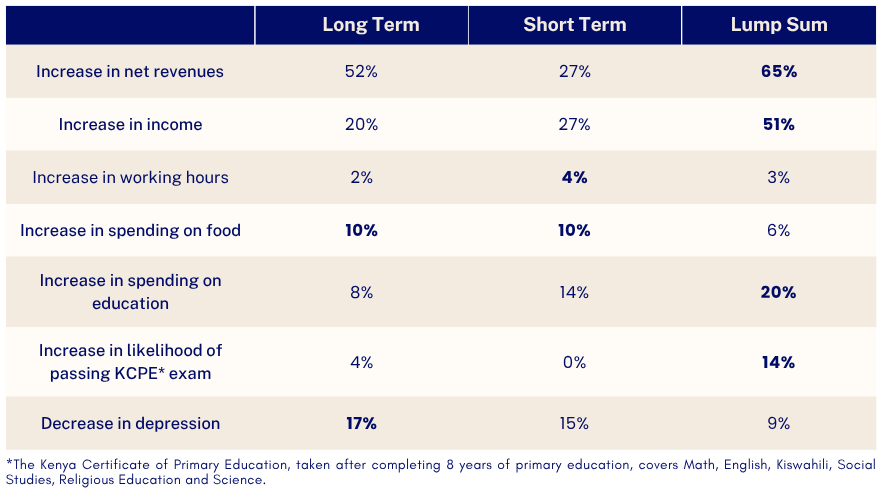

---
output:
  html_document:
    css: style.css
runtime: shiny
---


```{r setup, include=FALSE}
knitr::opts_chunk$set(echo = FALSE,
                      warning = FALSE,
                      message = FALSE)
library(tidyverse)
library(shiny)
library(knitr)
library(shinyWidgets)
library(tabulizer)
library(dplyr)
library(tidyr)
library(tibble)
library(purrr)
library(janitor)
library(miniUI)
library(rJava)
library(data.table)
library(scales)
library(kableExtra)
```

<p style="text-align: center; margin-top: 40px;">
    <span style="font-size: 20px;">
        <a href="https://conference.nber.org/conf_papers/f192616.pdf" target="_blank" style="text-decoration: underline; color: blue;">
            Universal Basic Income: Short-Term Results from a Long-Term Experiment in Kenya
        </a>
    </span><br>
    <span style="font-size: 16px;">
        An accessible summary and interactive data visualizations
    </span><br>
    <span style="font-size: 16px;">
        Created by 
        <a href="https://www.linkedin.com/in/helen-kay-staines/" target="_blank" style="text-decoration: underline; color: blue;">
            Helen Kay Staines
        </a>
    </span>
</p>


```{r data_import}

pdf_file <- "data/UBI Kenya paper.pdf"

for (i in 38:46) {
  table_i <-
    extract_tables(pdf_file, pages = i) %>% as.data.frame() %>% mutate_all(na_if, "")
  tname <- paste0("table_", i - 37, "_full")
  assign(tname, table_i)
}

```
\
\


**What happens when people are given enough money—consistently and unconditionally—to meet their basic needs?** 

Universal basic income (UBI) is based on the idea that every adult should be entitled to a minimum income. It differs from traditional safety net programs in that eligibility is not means-tested or conditional: payments are made universally without requiring individuals to meet income- or employment-based criteria. 

<u>**The case for UBI**:</u> 

* **Simplified distribution**: Targeting only specific people is costly and often misses eligible recipients. UBI avoids this by covering everyone.  

* **Improved mental wellbeing and productivity**: The security of regular income may reduce financial stress, making it easier to focus on work and plan.  
* **Greater willingness to invest**: With reduced risk of financial instability, people may be more willing to start businesses or make other income-generating investments.  
* **Breaking the poverty cycle**: If recipients use transfers to boost long-term earnings, this could create a sustainable pathway out of poverty.   
* **Positive spillovers**: Increased spending raises demand for goods and services, potentially generating new jobs and raising incomes more broadly.  

<u>**The case against UBI**:</u> 

* **Reduced work incentive**: Some worry that unconditional transfers may discourage recipients from working, leading to decreased productivity and a reliance on government support.

* **Risk of unhealthy spending**: There are concerns that some recipients may spend their UBI on alcohol, tobacco, or other non-essentials instead of, e.g., food and schooling.

* **Alternative priorities**: Critics argue that directing resources towards specific areas like education and health may better address societal needs. 

For low-income countries, the stakes are especially high. Many lack the administrative capacity to accurately identify who qualifies for targeted support. UBI sidesteps this challenge but at a significant fiscal cost. Policymakers need to know whether large-scale transfers can generate lasting benefits, such as higher earnings, greater tax revenue, and more employment. If so, UBI could eventually pay for itself or even be phased out once no longer needed.

## The Research Project {.tabset}

### Overview

To explore the short and long-term impact of UBI, researchers launched a large-scale experiment in two rural counties in Kenya. The study was designed to:  

- assess the effects of a **long-term UBI**—monthly payments over 12 years—on wellbeing, labor supply,  occupations, and earnings;  
- compare this to two less expensive alternatives:<br> 
&nbsp;&nbsp;1. a **short-term UBI program**, with identical monthly payments that ended after two years, and<br>
&nbsp;&nbsp;2. a **lump-sum transfer** equivalent in value to the short-term UBI, provided upfront.

The idea behind testing the lump-sum model is that it might enable earlier investment, without the need to build savings over time. If this leads to similar gains in income or productivity, it could offer a more cost-efficient alternative to regular transfers, which are more expensive to sustain. Similarly, if the short-term UBI produces lasting improvements in earnings or wellbeing—perhaps by easing financial pressure during a critical period—it may lessen the case for a costlier long-term program. On the other hand, long-term payments might have distinct economic and psychological effects: reducing stress, protecting against shocks, or giving recipients greater confidence to plan, wait, or borrow. Understanding not just **whether** UBI works, but **how** the structure of payments shapes its effects, is central to this research.

Answering these questions requires a rare kind of study: long in duration, wide in scope, and comprehensive in data. Capturing impacts across health, income, mental wellbeing, and local economies—plus any unintended spillover effects—meant tracking thousands of people over time. 

The study took place in **295 villages** across **Bomet** and **Siaya**, two of Kenya's  poorest counties. The transfers were implemented by **GiveDirectly**, an NGO specializing in digital cash transfers. The monthly amounts were set to cover most basic needs, such as food, health, or school expenses. Villages were randomly assigned to one of four groups:  

- `r kableExtra::text_spec("**Control**", color = "#CC79A7")`: 100 villages (approx. 11,000 people) received no transfers.   
- `r kableExtra::text_spec("**Long-term UBI**", color = "#E69F00")`: 44 villages (approx. 5,000 people). Adult aged 18+ received around USD 23 per month for 12 years.  
- `r kableExtra::text_spec("**Short-term UBI**", color = "#56B4E9")`: 80 villages (approx. 8,800 people). Adults received the same amount monthly, but only for 2 years.
- `r kableExtra::text_spec("**Lump-sum**", color = "#009E73")`: 71 villages (approx. 8,800 people). Adults received about USD 500 in two payments two months apart (to comply with transaction limits). This total was designed to match the short-term UBI, accounting for inflation.

By late 2019, the three treatment groups had each received roughly the same total amount, on average, and only those in the long-term were expected to receive more in the future. The next tabs explore the results across key outcomes, from business activity to education and wellbeing.

### Enterprises

In terms of **enterprises**—the number of enterprises, their costs, revenues, net revenues (after subtracting household labor), and assets—**all treatment groups saw increases across the board**. With the exception of assets, the Lump Sum group experienced the largest increase in each category, followed by Long Term, and then Short Term. 
\
```{r data_2}
names(table_2_full) <- table_2_full[1, ]
table_2 <- table_2_full[-c(1:2, 9, 11:19), ]
colnames(table_2)[1] <- "Treatment"
table_2 <- data.table::as.data.table(table_2) %>% fill(Treatment)

# Get columns to change
to_change <- colnames(table_2)[colnames(table_2) != "Treatment"]

# Add Sig to each column
to_change_sig <- paste0(to_change, " Sig")

# Function to extract all ∗ and collapse
fun_extrct_stars <- function(y) {
  z <- stringr::str_extract_all(y, "∗")
  lapply(z, function(x)
    paste0(x, collapse = ""))  %>%  unlist()
}

# Extracts the stars
table_2[, (to_change_sig) := lapply(.SD, fun_extrct_stars), .SDcols = to_change]

# Melt down
table_2 <- data.table::melt(table_2, id.vars = "Treatment")
table_2[, grp := ifelse(stringr::str_detect(value, "\\["), "SE", "Estimate")]
table_2[, grp := ifelse(stringr::str_detect(Treatment, "Control Mean"), "Control", grp)]
table_2[variable %in% to_change_sig, grp := "Sig"]

# Function to remove all brackets and stars, convert to numeric
fun_rmv_stars_brackets <- function(y) {
  z <- stringr::str_remove_all(y, "\\[|\\]|∗")
  as.numeric(z)
}

# Apply only to grp = Estimate and grp = SE
table_2[grp != "Sig", value := fun_rmv_stars_brackets(value)]

# Remove "Sig" from the significance variables (for casting wide)
table_2[, variable := stringr::str_remove_all(variable, " Sig")]

# Order the table
data.table::setorder(table_2, Treatment, variable, grp)

# Remove values where there are no stars
table_2 <- table_2[value != ""]

# Cast wide
table_2 <- data.table::dcast(table_2,
                             Treatment + variable ~ grp,
                             value.var = "value")

# Add columns for control mean, new estimate (control mean + estimate), lower CI boundary, upper CI boundary

add_new_columns <- function(data) {
  data <-
    data %>% group_by(variable) %>% fill('Control') %>% filter(Treatment !=
                                                                 "Control Mean")
  data <-
    mutate_at(data, c("Control", "Estimate", "SE"), as.numeric)
  data <- mutate(
    data,
    new_est = Control + Estimate,
    lower = new_est - 1.96 * SE,
    higher = new_est + 1.96 * SE
  )
  return(data)
}

table_2 <- add_new_columns(table_2)
table_2$variable[table_2$variable == "# Enterprises"] <-"Number of Enterprises"

#Rename arms, convert Treatment to factor var with levels
fun_recode_levels <- function(table) {
  table %>% mutate(
    Treatment = recode(
      Treatment,
      "Long Term Arm" = "Long Term",
      "Short Term Arm" = "Short Term",
      "Lumpsum Arm" = "Lump Sum"
    )
  ) %>%
    mutate(Treatment = fct_relevel(Treatment, "Long Term", "Short Term", "Lump Sum"))
}
table_2 <- fun_recode_levels(table_2)


#Plot
cbPalette <-
  c("Long Term" = "#E69F00", "Short Term" = "#56B4E9", "Lump Sum" = "#009E73") #color-blind friendly palette 
shapes <- c("Long Term" = 15, "Short Term" = 16, "Lump Sum" = 17)

p_value_text <- "
  <div style='font-size: 13px; font-family: Arial;'>
    <p>Because it would be incredibly time-consuming and costly for every single member of the study to be interviewed, only a sample of people in each group were surveyed. This means that the height of the bars are only estimates. With any estimate, there is a level of uncertainty because we can't be sure that the people we're interviewing are truly representative of the whole group. For example, what if the researchers only happened to talk to the recipients with the highest incomes? This uncertainty is like fog around the conclusions.</p>
</p>The p-value acts like a tool that helps cut through the fog of uncertainty: the lower the p-value, the more we can trust that the findings aren't just luck. One star means there is under a 10% chance that the result is purely coincidental, two stars means the chance is under 5%, and three stars means less than 1%. The more stars you see, the more confident you can be in the findings.</p>
</div>
"
p_value_label <- HTML("Show p-value levels <br /><div style='font-size: 12px;'>   * p < .10, ** p < .05, *** p < .01</div>")

CI_text <-
  "<div style='font-size: 13px; font-family: Arial;'>
  <p>There is some uncertainty around the findings because not every individual was surveyed—only a sample of them—and so the height of the bar is only an estimate. The confidence intervals on the plot show the range around the estimate in which we can be 95% sure the true value lies.</p>
</div>
"
bar_text <-
  "<div style='font-size: 13px; font-family: Arial;'>
  <p>There is some uncertainty around the findings because not every individual was surveyed—only a sample of them—and so the position of the points is only an estimate. The horizontal bars on the plot show the range around the estimate in which we can be 95% sure the true value lies.</p>
</div>
"

fun_select_cat <- function(table, cat) {
  table %>%
    filter(variable == cat)
}

ui <- fluidPage(
  tags$div(style = "margin-top: 15px;margin-bottom: 5px;",
  sidebarLayout(
  sidebarPanel(
    selectInput('cat', 'Select Category', unique(table_2$variable)),
    checkboxInput("control_mean", label = "Show average for non-recipients", value = FALSE),
    checkboxInput("p_values", label = p_value_label, value = FALSE),
    checkboxInput("error_bars", label = "Show 95% confidence intervals", value = FALSE),
    actionButton("Explain_p_values", "Explain p-values"),
    actionButton("Explain_error_bars", "Explain 95% confidence intervals")
  ),
  mainPanel(plotOutput('plot_overall', height = "380px"))
)))

server <- function(input, output, session) {
  observeEvent(input$Explain_p_values, {
    showModal(modalDialog(HTML(p_value_text)))
  })
  observeEvent(input$Explain_error_bars, {
    showModal(modalDialog(HTML(CI_text)))
  })
  
  output$plot_overall <- renderPlot({
    table_2_filtered <- fun_select_cat(table_2, input$cat) |>
      ungroup()
    
    control_y <- table_2_filtered %>% pull(Control) |> unique()
    
    title <- if (input$cat == "Number of Enterprises") {
      input$cat
    } else if (input$cat == "Assets") {
      paste(input$cat, "(USD)", sep=" ")
    } else {
      paste(input$cat, "(USD) for the last 30 days", sep = " ")
    }
    
    layer_error <- if (input$error_bars) {
      geom_errorbar(aes(ymin = lower, ymax = higher), width = 0.25)
    }
    
    layer_p <- if (input$p_values) {
      column_y_text <- if (input$error_bars) {
        "higher"                                  
      } else {
        "new_est"
      }
      max_y_text <-
        table_2_filtered |>          
        filter(!is.na(Sig)) |>                   
        pull(column_y_text) |>                   
        max()
      list(
        geom_label(
          aes(
            label = Sig,
            y = .data[[column_y_text]],
            group = variable
          ),
          vjust = 0,
          fill = NA,
          label.size = 0,
          label.padding = unit(10, "pt"),
          position = position_dodge(width = 0.9),
          na.rm = TRUE
        ),
        if (!is.na(max_y_text))
          expand_limits(y = c(0, max_y_text * 1.05))              
      )
    }
    
    layer_control <- if (input$control_mean) {
      list(
        annotate(
          "label",
          x = 3.61,
          y = control_y,
          label = "Control\nmean",
          colour = "#CC79A7",
          fontface = 2,
          size = 4.5,
          label.size = 0,
          fill = NA,
          vjust = 0
        ),
        geom_hline(
          aes(yintercept = Control),
          linetype = "dashed",
          col = "#CC79A7",
          size = 1.5
        ),
        expand_limits(x = c(
          1, nlevels(table_2$Treatment) + 0.8
        ))
      )
    }
    
    table_2_filtered |>
      ggplot(aes(x = Treatment, y = new_est, fill = Treatment)) +
      geom_col() +
      scale_fill_manual(values = cbPalette) +
      guides(fill = FALSE) +
      scale_y_continuous(labels = label_comma(), expand = c(0, 0)) +
      theme_classic() +
      scale_x_discrete(drop = FALSE) +
      theme(
        plot.title = element_text(
          hjust = 0.5,
          size = 14,
          face = "bold"
        ),
        axis.text = element_text(size = 12)
      ) +
      layer_p +
      layer_error +
      layer_control +
      labs(title = title, x = NULL, y = NULL)
  })
}
shinyApp(ui = ui, server = server)

```
\

### Revenues 

**Most of the increase in net revenues came from enterprises outside of agriculture** (see left-hand plot). Across all groups, the retail sector saw the greatest increase in both the number of enterprises and net revenue, compared to manufacturing, services, and transportation (see right-hand plot).
\
```{r data_3}
table_3 <- table_3_full[-c(3, 10, 12:20), -c(10, 11)]

table_3 <- data.frame(lapply(table_3, function(x) {
  gsub("Net Rev", "Net-Rev", x)
})) |>
  separate_wider_delim(
    cols = c(9),
    names = LETTERS[1:2],
    names_sep = "",
    delim = " ",
    too_few = "align_start"
  )

table_3[1, 1] = "Treatment"
table_3[1, 2:6][is.na(table_3[1, 2:6])] <- "Ag"
table_3[1, 7:11][is.na(table_3[1, 7:11])] <- "Non-Ag"

names(table_3) <-
  apply(table_3, 2, function(x)
    paste(x[1], x[2], sep = " "))
table_3 <- table_3[-c(1, 2), ]
colnames(table_3)[1] <- "Treatment"
names(table_3) <- gsub("Net-Rev", "Net Rev", names(table_3))

table_3 <- data.table::as.data.table(table_3) %>% fill(Treatment)

to_change <- colnames(table_3)[colnames(table_3) != "Treatment"]

to_change_sig <- paste0(to_change, " Sig")

table_3[, (to_change_sig) := lapply(.SD, fun_extrct_stars), .SDcols = to_change]

table_3 <- data.table::melt(table_3, id.vars = "Treatment")
table_3[, grp := ifelse(stringr::str_detect(value, "\\["), "SE", "Estimate")]
table_3[, grp := ifelse(stringr::str_detect(Treatment, "Control Mean"), "Control", grp)]
table_3[variable %in% to_change_sig, grp := "Sig"]

table_3[grp != "Sig", value := fun_rmv_stars_brackets(value)]

table_3[, variable := stringr::str_remove_all(variable, " Sig")]

data.table::setorder(table_3, Treatment, variable, grp)

table_3 <- table_3[value != ""]

table_3 <- data.table::dcast(table_3,
                             Treatment + variable ~ grp,
                             value.var = "value")

table_3 <-
  table_3 %>% mutate(Ag_or_Non = ifelse(
    stringr::str_detect(variable, "Non-Ag"),
    "Non-Agricultural",
    "Agricultural"
  ))
table_3$variable <- gsub(".*\\Ag ", "", table_3$variable)


add_new_columns_ag_non <- function(data) {
  data <-
    data %>% group_by(Ag_or_Non, variable) %>% fill('Control') %>% filter(Treatment !=
                                                                            "Control Mean")
  data <-
    mutate_at(data, c("Control", "Estimate", "SE"), as.numeric)
  data <- mutate(
    data,
    new_est = Control + Estimate,
    lower = new_est - 1.96 * SE,
    higher = new_est + 1.96 * SE
  )
  
  return(data)
}

table_3 <- add_new_columns_ag_non(table_3)
table_3$variable[table_3$variable == "# Ent."] <-
  "Number of Enterprises"
table_3$variable <- gsub('Rev.', 'Revenues', table_3$variable)

table_3 <- fun_recode_levels(table_3)

for (i in 59:68) {
  table_i <- extract_tables(pdf_file, pages = i)
  tname <- paste0("table_E.", i - 58, "_full")
  assign(tname, table_i)
}

table_E.9_full <-
  data.table::as.data.table(table_E.9_full) %>% mutate_all(na_if, "")
table_E.9 <- table_E.9_full[-c(10, 12:16), ]
table_E.9_9 <-
  table_E.9[-3:-1, ] |> separate_wider_delim(
    cols = V2:V5,
    names = LETTERS[1:2],
    delim = " ",
    names_sep = ""
  )
table_E.9_n <- table_E.9[1:2, ] |>
  mutate(across(V2:V5, ~ str_replace_all(.x, "s ", "s_"))) |>
  separate_wider_delim(
    cols = V2:V5,
    names = LETTERS[1:2],
    names_sep = "",
    delim = "_",
    too_few = "align_start"
  )

table_E.9_names <- c("Treatment")
for (j in 2:9) {
  if (is.na(table_E.9_n[1, j])) {
    table_E.9_names <-
      c(table_E.9_names, paste(table_E.9_n[1, j - 1], table_E.9_n[2, j]))
  } else {
    table_E.9_names <-
      c(table_E.9_names, paste(table_E.9_n[1, j], table_E.9_n[2, j]))
  }
}

names(table_E.9_9) <- table_E.9_names
table_E.9_9 <- as.data.table(table_E.9_9) %>% fill(Treatment)

to_change <-
  colnames(table_E.9_9)[colnames(table_E.9_9) != "Treatment"]

to_change_sig <- paste0(to_change, " Sig")

table_E.9_9[, (to_change_sig) := lapply(.SD, fun_extrct_stars), .SDcols = to_change]

table_E.9_9 <- data.table::melt(table_E.9_9, id.vars = "Treatment")
table_E.9_9[, grp := ifelse(stringr::str_detect(value, "\\["), "SE", "Estimate")]
table_E.9_9[, grp := ifelse(stringr::str_detect(Treatment, "Control Mean"), "Control", grp)]
table_E.9_9[variable %in% to_change_sig, grp := "Sig"]

table_E.9_9[grp != "Sig", value := fun_rmv_stars_brackets(value)]

table_E.9_9[, variable := stringr::str_remove_all(variable, " Sig")]

data.table::setorder(table_E.9_9, Treatment, variable, grp)

table_E.9_9 <- table_E.9_9[value != ""]

table_E.9_9 <- data.table::dcast(table_E.9_9,
                                 Treatment + variable ~ grp,
                                 value.var = "value")

table_E.9_9 <-
  table_E.9_9 %>% mutate(Ent_or_Rev = ifelse(
    stringr::str_detect(variable, "# Enterprises"),
    "Number of Enterprises",
    "Net Revenues"
  ))
strings_to_remove <- c(" # Enterprises", " Net Revenues")
table_E.9_9$variable <-
  str_replace(table_E.9_9$variable,
              paste(strings_to_remove, collapse = "|"),
              "")

add_new_columns_ent_rev <- function(data) {
  data <-
    data %>% group_by(Ent_or_Rev, variable) %>% fill('Control') %>% filter(Treatment !=
                                                                             "Control Mean")
  data <-
    mutate_at(data, c("Control", "Estimate", "SE"), as.numeric)
  data <- mutate(
    data,
    new_est = Control + Estimate,
    lower = new_est - 1.96 * SE,
    higher = new_est + 1.96 * SE
  )
  
  return(data)
}

table_E.9_9 <- add_new_columns_ent_rev(table_E.9_9)
table_E.9_9 <- fun_recode_levels(table_E.9_9)


ui <- fluidPage(
  tags$div(style = "margin-top: 13px;",
  tags$style(HTML("
    .tabbable > .nav > li > a                  {background-color: #0072B2;  color:white}
    .tabbable > .nav > li[class=active]    > a {background-color: white; color:#0072B2}
  ")),
  
  tabsetPanel(
  tabPanel(title = "Agricultural vs. Non-Agricultural",
           sidebarLayout(
             sidebarPanel(
               selectInput(
                 'cat',
                 'Select Category',
                 unique(table_3$variable),
                 selected="Net Revenues"
               ),
               checkboxInput("control_mean", label = "Show average for non-recipients", value = FALSE),
               checkboxInput("p_values_A", label =  p_value_label, value = FALSE),
               checkboxInput("error_bars_A", label = "Show 95% confidence intervals", value = FALSE),
               actionButton("Explain_p_values_A", "Explain p-values"),
               actionButton("Explain_error_bars_A", "Explain 95% confidence intervals")
             ),
             mainPanel(plotOutput('plot_ag_non_ag', height = 340))
           )),
  tabPanel(title = "Non-Agricultural Sectors",
           sidebarLayout(
             sidebarPanel(
               style = "margin: 0px;",
               selectInput('cat_B', 'Select Category', unique(table_E.9_9$Ent_or_Rev)),
               pickerInput(
                 inputId = "controls",
                 label = "Show average of non-recipients",
                 choices = unique(table_E.9_9$variable),
                 multiple = TRUE,
                 selected = "Retail Trade"
               ),
               checkboxInput("p_values", label =  p_value_label, value = FALSE),
               checkboxInput("error_bars", label = "Show 95% confidence intervals", value = FALSE),
               actionButton("Explain_p_values", "Explain p-values"),
               actionButton("Explain_error_bars", "Explain 95% confidence intervals")
             ),
             mainPanel(plotOutput('plot_sectors', height = 340))
           ))
)))

server <- function(input, output, session) {
  observeEvent(input$Explain_p_values_A, {
    showModal(modalDialog(HTML(p_value_text)))
  })
  observeEvent(input$Explain_error_bars_A, {
    showModal(modalDialog(HTML(CI_text)))
  })
  observeEvent(input$Explain_p_values, {
    showModal(modalDialog(HTML(p_value_text)))
  })
  observeEvent(input$Explain_error_bars, {
    showModal(modalDialog(HTML(CI_text)))
  })
  
  output$plot_ag_non_ag <- renderPlot({
    table_3_filtered <- fun_select_cat(table_3, input$cat) |>
      ungroup()
    
    control_y <- table_3_filtered %>% pull(Control) |> unique()
    
    title <- if (input$cat == "Number of Enterprises") {
      input$cat
    } else if (input$cat == "Assets") {
      paste(input$cat, "(USD)", sep=" ")
    } else {
      paste(input$cat, "(USD) for the last 30 days", sep = " ")
    }
    
    layer_error <- if (input$error_bars_A) {
      geom_errorbar(aes(ymin = lower, ymax = higher), width = 0.25)
    }
    
    layer_p <- if (input$p_values_A) {
      column_y_text <- if (input$error_bars_A) {
        "higher"
      } else {
        "new_est"
      }
      max_y_text <- table_3_filtered |>
        filter(!is.na(Sig)) |>
        pull(column_y_text) |>
        max()
      list(
        geom_label(
          aes(
            label = Sig,
            y = .data[[column_y_text]],
            group = variable
          ),
          vjust = 0,
          fill = NA,
          label.size = 0,
          label.padding = unit(10, "pt"),
          position = position_dodge(width = 0.9),
          na.rm = TRUE
        ),
        if (!is.na(max_y_text))
          expand_limits(y = c(0, max_y_text * 1.05))
      )
    }
    
    
    layer_control <- if (input$control_mean) {
      list(
        geom_hline(
          aes(yintercept = Control),
          linetype = "dashed",
          col = "#CC79A7",
          size = 1.5
        ),
        expand_limits(x = c(1, nlevels(
          table_3$Treatment
        ) + 1.1))
      )
    }
    
    table_3_filtered |>
      ggplot(aes(x = Treatment, y = new_est, fill = Treatment)) +
      geom_col() +
      scale_fill_manual(values = cbPalette) +
      guides(fill = FALSE) +
      scale_y_continuous(labels = label_comma(), expand = c(0, 0)) +
      theme_classic() +
      scale_x_discrete(drop = FALSE) +
      theme(
        plot.title = element_text(
          hjust = 0.5,
          size = 14,
          face = "bold"
        ),
        axis.text = element_text(size = 12)
      ) +
      layer_p +
      layer_error +
      layer_control +
      labs(title = title, x = NULL, y = NULL) +
      facet_wrap( ~ Ag_or_Non) +
      theme(strip.background = element_blank(),
            strip.text = element_text(size = 12, face = "bold"))
  })
  
  output$plot_sectors <- renderPlot({
    cbPalette_4 <- c(
      "Manufacturing" = "#999999",
      "Retail Trade" =  "#F0E442",
      "Services" = "#0072B2",
      "Transportation" = "#D55E00"
    )
    
    fun_select_cat <- function(table, cat) {
      table %>%
        filter(Ent_or_Rev == cat)
    }
    
    table_E.9_9_filtered <-
      fun_select_cat(table_E.9_9, input$cat_B) |>
      ungroup()
    
    control_y <- table_E.9_9_filtered %>% pull(Control) |> unique()
    
    title <- if (input$cat_B == "Number of Enterprises") {
      input$cat_B
    } else {
      paste(input$cat_B, "(USD)", sep = " ")
    }
    
    layer_error <- if (input$error_bars) {
      lim_lower <- table_E.9_9_filtered |>
        pull(lower) |>
        min()
      lim_higher <- table_E.9_9_filtered |>
        pull(higher) |>
        max()
      
      list(
        geom_errorbar(
          aes(ymin = lower,
              ymax = higher),
          width = 0.25,
          position = position_dodge(width = 0.9)
        ),
        if (input$cat_B == "Net Revenues")
          expand_limits(y = c(lim_lower * 1.2, lim_higher))
      )
      
    }
    
    layer_p <- if (input$p_values) {
      column_y_text <- if (input$error_bars) {
        "higher"                                  
      } else {
        "new_est"
      }
      max_y_text <-
        table_E.9_9_filtered |>          
        filter(!is.na(Sig)) |>                   
        pull(column_y_text) |>                   
        max()
      
      list(
        geom_label(
          aes(
            label = Sig,
            y = .data[[column_y_text]],
            group = variable
          ),
          vjust = 0,
          fill = NA,
          label.size = 0,
          label.padding = unit(10, "pt"),
          position = position_dodge(width = 0.9),
          na.rm = TRUE
        ),
        if (!is.na(max_y_text))
          expand_limits(y = c(0, max_y_text * 1.05))              
      )
    }
    
    layer_h <- if (!is.null(input$controls)) {
      geom_hline(
        data = {
          table_E.9_9_filtered %>% filter(variable %in% input$controls)
        },
        aes(yintercept = Control, color = variable),
        linetype = "dashed",
        linewidth = 1
      )
    }
    
    table_E.9_9_filtered |>
      ggplot(aes(x = Treatment, y = new_est, fill = variable)) +
      geom_col(position = position_dodge(width = 0.9)) +
      scale_fill_manual(values = cbPalette_4) +
      scale_color_manual(values = subset(cbPalette_4,
                                         names(cbPalette_4) %in% input$controls)) +
      scale_y_continuous(labels = label_comma(), expand = c(0, 0)) +
      theme_classic() +
      scale_x_discrete(drop = FALSE) +
      theme(
        plot.title = element_text(
          hjust = 0.5,
          size = 14,
          face = "bold"
        ),
        axis.text = element_text(size = 12),
        legend.title = element_blank(),
        legend.text = element_text(size = 12)
      ) +
      layer_p +
      layer_error +
      layer_h +
      guides(color = "none") +
      labs(title = title, x = NULL, y = NULL)
    
  })
}

shinyApp(ui = ui, server = server)

```
\

### Labor

Receiving cash transfers did not lead to a reduction in work. **Across all groups, recipients worked more hours and earned more income than non-recipients.** There was also a shift away from <abbr title="working for others" >wage employment</abbr> towards self-employment—particularly in non-agricultural sectors. The highest jump in income was seen in the lump-sum group, whose earnings rose by about half the amount earned by non-recipients.
\
```{r data_4}
table_4 <- table_4_full[-c(3,10,12:20),]

table_4_9 <- table_4[-2:-1,] |> separate_wider_delim(cols=X2:X5, names=LETTERS[1:2], 
                                                         delim=" ", names_sep = "")
table_4_n <- table_4[1:2,] |>
  mutate(across(X2:X5, ~str_replace_all(.x, "s ", "s_")))|>
  separate_wider_delim(cols = X2:X5, names=LETTERS[1:2], names_sep = "",
                       delim="_", too_few = "align_start") 

table_4_9_names <- c("Treatment")
for (j in 2:9) {
  if(is.na(table_E.9_n[1,j])) {
    table_4_9_names <- c(table_4_9_names, paste(table_4_n[1,j-1], table_4_n[2,j]))
  } else {
    table_4_9_names <- c(table_4_9_names, paste(table_4_n[1,j],table_4_n[2,j]))
  }
}

names(table_4_9) <- table_4_9_names
table_4_9 <- as.data.table(table_4_9) %>% fill(Treatment)

to_change <- colnames(table_4_9)[colnames(table_4_9) != "Treatment"]

to_change_sig <- paste0(to_change, " Sig")

table_4_9[, (to_change_sig) := lapply(.SD, fun_extrct_stars), .SDcols = to_change]

table_4_9 <- data.table::melt(table_4_9, id.vars = "Treatment")
table_4_9[, grp := ifelse(stringr::str_detect(value, "\\["), "SE", "Estimate")]
table_4_9[, grp := ifelse(stringr::str_detect(Treatment, "Control Mean"), "Control", grp)]
table_4_9[variable %in% to_change_sig, grp := "Sig"]

table_4_9[grp != "Sig", value := fun_rmv_stars_brackets(value)]

table_4_9[, variable := stringr::str_remove_all(variable, " Sig")]

data.table::setorder(table_4_9, Treatment, variable, grp)

table_4_9 <- table_4_9[value != ""]

table_4_9 <- data.table::dcast(
  table_4_9,
  Treatment + variable ~ grp,
  value.var = "value"
)

table_4_9 <-
  table_4_9 %>% mutate(Hours_or_Inc = ifelse(
    stringr::str_detect(variable, "Hours"),
    "Hours",
    "Income"
  ))

strings_to_remove <- c(" Hours", " Income")
table_4_9$variable <-
  str_replace(table_4_9$variable,
              paste(strings_to_remove, collapse = "|"),
              "")

add_new_columns_hours_inc <- function(data) {
  data <-
    data %>% group_by(Hours_or_Inc, variable) %>% fill('Control') %>% filter(Treatment != "Control Mean")
  data <-
    mutate_at(data, c("Control", "Estimate", "SE"), as.numeric)
  data <- mutate(
    data,
    new_est = Control + Estimate,
    lower = new_est - 1.96 * SE,
    higher = new_est + 1.96 * SE
  )
  
  return(data)
}
  
table_4_9 <- add_new_columns_hours_inc(table_4_9)
table_4_9 <- fun_recode_levels(table_4_9)

ui <- fluidPage(
   tags$div(style = "margin-top: 15px;margin-bottom: 5px;",
  sidebarLayout(
             sidebarPanel(
               selectInput('cat', 'Select Category', unique(table_4_9$Hours_or_Inc), selected = "Income"),
               pickerInput(
                 inputId = "controls",
                 label = "Show average of non-recipients",
                 choices = rev(unique(table_4_9$variable)),
                 multiple = TRUE,
                 selected = "Overall",
                 options = list(`actions-box` = TRUE)
               ),
               checkboxInput("p_values", label =  p_value_label, value = FALSE),
               checkboxInput("error_bars", label = "Show 95% confidence intervals", value = FALSE),
               actionButton("Explain_p_values", "Explain p-values"),
               actionButton("Explain_error_bars", "Explain 95% confidence intervals")
             ),
             mainPanel(plotOutput('plot', height = "380px"))
           )))

server <- function(input, output, session) {
 observeEvent(input$Explain_p_values, {
    showModal(modalDialog(HTML(p_value_text)))
  })
  observeEvent(input$Explain_error_bars, {
    showModal(modalDialog(HTML(CI_text)))
  })
  
  output$plot <- renderPlot({
    cbPalette_4 <- c(
      "Overall" = "#999999",
      "Self Employment (Ag)" =  "#F0E442",
      "Self Employment (Non-Ag)" = "#0072B2",
      "Wage Employment" = "#D55E00"
    )
    
    fun_select_cat <- function(table, cat) {
      table %>%
        filter(Hours_or_Inc == cat)
    }
    
    table_4_filtered <-
      fun_select_cat(table_4_9, input$cat) |>
      ungroup()
    
    control_y <- table_4_filtered %>% pull(Control) |> unique()
    
    title <- if (input$cat == "Hours") {
      paste(input$cat, "Worked in the Past 12 Months")
    } else {
      paste0(input$cat, "/Profits (USD) Earned in the Past 12 Months")
    }
    
    y_lab_hrs_usd <- if(input$cat == "Hours") {
      "Hours"
    } else {
      "USD"
    }
    
    lab_text <- if (input$cat == "Hours") {
      list(title = paste(input$cat, "Worked in the Past 12 Months", sep=" "), x=" ", y = "Hours")
    } else {
      list(title = paste0(input$cat, "/Profits (USD) Earned in the Past 12 Months"), x="", y = "USD")
    }
  
    layer_error <- if (input$error_bars) {
      geom_errorbar(aes(ymin = lower, ymax = higher), width = 0.25, position = position_dodge(width = 0.9))
    }
    
    layer_p <- if (input$p_values) {
      column_y_text <- if (input$error_bars) {
        "higher"                                   
      } else {
        "new_est"
      }
      max_y_text <-
        table_4_filtered |>          
        filter(!is.na(Sig)) |>                   
        pull(column_y_text) |>                   
        max()
      
      list(
        geom_label(
          aes(
            label = Sig,
            y = .data[[column_y_text]],
            group = variable
          ),
          hjust = 0,
          fill = NA,
          label.size = 0,
          label.padding = unit(10, "pt"),
          position = position_dodge(width = 0.9),
          na.rm = TRUE
        ),
        if (!is.na(max_y_text))
          expand_limits(y = c(0, max_y_text * 1.05))              
      )
    }
    
    layer_h <- if (!is.null(input$controls)) {
      geom_hline(
        data = {
          table_4_filtered %>% filter(variable %in% input$controls)
        },
        aes(yintercept = Control, color = variable),
        linetype = "dashed",
        linewidth = 1
      )
    }
    
    table_4_filtered |>
      ggplot(aes(x = Treatment, y = new_est, fill = variable)) +
      geom_col(position = position_dodge(width = 0.9)) +
      scale_fill_manual(breaks = c("Wage Employment","Self Employment (Non-Ag)","Self Employment (Ag)","Overall"),
                        values = cbPalette_4) +
      scale_color_manual(values = subset(cbPalette_4,
                                         names(cbPalette_4) %in% input$controls)) +
      scale_y_continuous(labels = label_comma(), expand = c(0, 0)) +
      theme_classic() +
      scale_x_discrete(drop = FALSE) +
      theme(
        plot.title = element_text(
          hjust = 0.5,
          size = 14,
          face = "bold"
        ),
        axis.text = element_text(size = 12),
        legend.title = element_blank(),
        legend.text = element_text(size = 12),
        axis.title.x = element_text(size = 13)
      ) +
      layer_p +
      layer_error +
      layer_h +
      guides(color = "none") +
      labs(title = lab_text$title, x = lab_text$x, y = lab_text$y) +
      coord_flip()
    
  })
}

shinyApp(ui = ui, server = server)

```
\

### Investments

**Recipients in all groups were more likely to make large investments than non-recipients**. The lump-sum group invested the most overall.
\

```{r}
table_E.5_full <-
  data.table::as.data.table(table_E.5_full) %>% mutate_all(na_if, "")

table_E5 <- table_E.5_full[-c(1:2, 9, 11:15)]
names(table_E5) <- as.character(table_E.5_full[1, ])
colnames(table_E5)[1] <- "Treatment"

table_E5 <- data.table::as.data.table(table_E5) %>% fill(Treatment) %>% select(-c(4:5))

# Get columns to change
to_change <- colnames(table_E5)[colnames(table_E5) != "Treatment"]
to_change_sig <- paste0(to_change, " Sig")

# Extracts the stars
table_E5[, (to_change_sig) := lapply(.SD, fun_extrct_stars), .SDcols = to_change]

# Melt down
table_E5 <- data.table::melt(table_E5, id.vars = "Treatment")
table_E5[, grp := ifelse(stringr::str_detect(value, "\\["), "SE", "Estimate")]
table_E5[, grp := ifelse(stringr::str_detect(Treatment, "Control Mean"), "Control", grp)]
table_E5[variable %in% to_change_sig, grp := "Sig"]

# Apply only to grp = Estimate and grp = SE
table_E5[grp != "Sig", value := fun_rmv_stars_brackets(value)]

# Remove "Sig" from the significance variables (for casting wide)
table_E5[, variable := stringr::str_remove_all(variable, " Sig")]

# Order the table
data.table::setorder(table_E5, Treatment, variable, grp)

# Remove values where there are no stars
table_E5 <- table_E5[value != ""]

# Cast wide
table_E5 <- data.table::dcast(table_E5,
                             Treatment + variable ~ grp,
                             value.var = "value")

# Add columns for control mean, new estimate (control mean + estimate), lower CI boundary, upper CI boundary as %s of control means
add_new_columns_prcts <- function(data) {
  data <-
    data %>% group_by(variable) %>% fill('Control') %>% filter(Treatment != "Control Mean")
  data <-
    mutate_at(data, c("Control", "Estimate", "SE"), as.numeric)
  data <- mutate(
    data,
    new_est_pct = 100* ((Control + Estimate)/Control),
    lower_pct = 100* (((Control + Estimate) - 1.96 * SE)/Control),
    higher_pct = 100* (((Control + Estimate) + 1.96 * SE)/Control)
  )
  
  return(data)
}

table_E5 <- add_new_columns_prcts(table_E5)

#Rename arms, convert Treatment to factor var with levels
fun_recode_levels_rvrs <- function(table) {
  table %>% mutate(
    Treatment = recode(
      Treatment,
      "Lumpsum Arm" = "Lump Sum",
      "Short Term Arm" = "Short Term",
      "Long Term Arm" = "Long Term"
    )
  ) %>%
    mutate(Treatment = fct_relevel(Treatment, "Long Term", "Short Term", "Lump Sum"))
}

table_E5 <- fun_recode_levels_rvrs(table_E5)

ui <- fluidPage(
   tags$div(style = "margin-top: 15px;margin-bottom: 5px;",
  tagList(
  tags$head(tags$style("body{overflow:hidden;}"))),
  sidebarLayout(
             sidebarPanel(
               pickerInput(
                 inputId = "group", 
                 label = "Select Group", 
                 choices = unique(table_E5$Treatment),
                 multiple = TRUE,
                 selected = unique(table_E5$Treatment),
                 options = list(`actions-box` = TRUE)
                 ),
               checkboxInput("p_values", label =  p_value_label, value = FALSE),
               actionButton("Explain_p_values", "Explain p-values"),
               actionButton("Explain_bars", "Explain bars"),
               tags$hr(style = "margin-top: 5px; margin-bottom: 5px;"),
            htmlOutput("plotExplain")
             ),
             mainPanel(plotOutput('plot', height = "380px"))
           )))

server <- function(input, output, session) {

  observeEvent(input$Explain_p_values, {
    showModal(modalDialog(HTML(p_value_text)))
  })
  observeEvent(input$Explain_bars, {
    showModal(modalDialog(HTML(bar_text)))
  })
  
  table_E5_filtered <-reactive({
        req(input$group)  # Make sure input$group is not NULL
        filtered <- table_E5[table_E5$Treatment %in% input$group,]
        return(filtered)
      })
  
  output$plotExplain <- renderUI({
        HTML('<span style="font-size: 12px; border: 1px solid black; padding: 5px; display: block;overflow: hidden;">This plot shows how much each group invested compared to non-recipients. The vertical dashed line shows the average amount the control group invested; anything to the right of this line indicates that the treatment group invested more than the control group.</span>')
    })
  
  output$plot <- renderPlot({
  
    req(table_E5_filtered())
  
   title <- "Investments by UBI Group Compared to Non-Recipients"
   
   
   
   layer_p <- if (input$p_values) {
    column_y_text <- "higher_pct"
    
    max_y_text <-
      table_E5_filtered() |>          
      filter(!is.na(Sig)) |>                   
      pull(column_y_text) |>                   
      max()
    
    list(
      geom_label(
        aes(
          label = Sig,
          y = .data[[column_y_text]],
          group = Treatment
        ),
        hjust = 0,
        fill = NA,
        label.size = 0,
        label.padding = unit(10, "pt"),
        position = position_dodge(width = 0.9),
        na.rm = TRUE
      ),
      if (!is.na(max_y_text))
        expand_limits(y = c(75, max_y_text * 1.05))              
    )
  }
  
   table_E5_filtered() |>
    ggplot(aes(x = variable, y = new_est_pct, col = Treatment, shape =Treatment)) +
     geom_hline(aes(yintercept = 100),
        linetype = "dashed",
        linewidth = 1) +
    geom_point(position = position_dodge(width = 0.9),size=3) +
    scale_color_manual(name = "Color and Shape",
                       breaks = c("Lump Sum", "Short Term", "Long Term"),
                       values = subset(cbPalette,
                                         names(cbPalette) %in% input$group)) +
    scale_shape_manual(name = "Color and Shape",
                       breaks = c("Lump Sum", "Short Term", "Long Term"),
                       values = subset(shapes,
                                         names(shapes) %in% input$group)) +
    scale_y_continuous(labels = label_comma()) +
    theme_classic() +
    scale_x_discrete(drop = FALSE) +
    theme(
      plot.title = element_text(
        hjust = 0.5,
        size = 14,
        face = "bold"
      ),
      axis.text = element_text(size = 12),
      axis.title = element_text(size=12),
      legend.title = element_blank(),
      legend.text = element_text(size = 12)
    ) +
    layer_p +
    geom_errorbar(aes(ymin = lower_pct, ymax = higher_pct), width = 0.25, position = position_dodge(width = 0.9)) +
    labs(title = title, y = "Percentage of Control Group", x = NULL) +
    coord_flip()
   
  })
}

shinyApp(ui = ui, server = server)
```
\

### Spending

**Total consumption increased across all groups**, with the sharpest rise among short-term UBI recipients. **Spending on education and food was consistently higher than in the control group**, while patterns in health spending were less clear.
\
```{r data_5}
names(table_5_full) <- table_5_full[1,]
table_5 <- table_5_full[-c(1:2,9,11:19),-5]
colnames(table_5)[1] <- "Treatment"

table_5 <- data.table::as.data.table(table_5) %>% fill(Treatment)

to_change <- colnames(table_5)[colnames(table_5) != "Treatment"]

to_change_sig <- paste0(to_change, " Sig")

table_5[, (to_change_sig) := lapply(.SD, fun_extrct_stars), .SDcols = to_change]

table_5 <- data.table::melt(table_5, id.vars = "Treatment")
table_5[, grp := ifelse(stringr::str_detect(value, "\\["), "SE", "Estimate")]
table_5[, grp := ifelse(stringr::str_detect(Treatment, "Control Mean"), "Control", grp)]
table_5[variable %in% to_change_sig, grp := "Sig"]

table_5[grp != "Sig", value := fun_rmv_stars_brackets(value)]

table_5[, variable := stringr::str_remove_all(variable, " Sig")]

data.table::setorder(table_5, Treatment, variable, grp)

table_5 <- table_5[value != ""]

table_5 <- data.table::dcast(
  table_5,
  Treatment + variable ~ grp,
  value.var = "value"
)

table_5 <- add_new_columns_prcts(table_5) 

table_5 <- fun_recode_levels_rvrs(table_5)

ui <- fluidPage(
  tags$div(style = "margin-top: 15px;margin-bottom: 5px;",
  tagList(
  tags$head(tags$style("body{overflow:hidden;}"))),
  sidebarLayout(
             sidebarPanel(
               style = "margin: 0px;",
               pickerInput(
                 inputId = "group", 
                 label = "Select Group", 
                 choices = unique(table_5$Treatment),
                 multiple = TRUE,
                 selected = unique(table_5$Treatment),
                 options = list(`actions-box` = TRUE)
                 ),
               checkboxInput("p_values", label =  p_value_label, value = FALSE),
               actionButton("Explain_p_values", "Explain p-values"),
               actionButton("Explain_bars", "Explain bars"),
               tags$hr(style = "margin-top: 5px; margin-bottom: 5px;"),
            htmlOutput("plotExplain")
             ),
             mainPanel(plotOutput('plot', height = "380px"))
           )))

server <- function(input, output, session) {

  observeEvent(input$Explain_p_values, {
    showModal(modalDialog(HTML(p_value_text)))
  })
  observeEvent(input$Explain_bars, {
    showModal(modalDialog(HTML(bar_text)))
  })
  
  
  table_5_filtered <-reactive({
        req(input$group)  # Make sure input$group is not NULL
        filtered <- table_5[table_5$Treatment %in% input$group,]
        return(filtered)
      })
  
  output$plotExplain <- renderUI({
        HTML('<span style="font-size: 12px; border: 1px solid black; padding: 5px; display: block;">This plot shows how much each group consumed compared to non-recipients. The dashed line is the amount the control group consumed; anything on either side of this line shows how much more or less the treatment groups consumed than the control group.</span>')
    })
  
  output$plot <- renderPlot({
  
    req(table_5_filtered())
  
   title <- "Consumption by UBI Group Compared to Non-Recipients"
   
   
   
   layer_p <- if (input$p_values) {
    column_y_text <- "higher_pct"
    
    max_y_text <-
      table_5_filtered() |>          
      filter(!is.na(Sig)) |>                   
      pull(column_y_text) |>                   
      max()
    
    list(
      geom_label(
        aes(
          label = Sig,
          y = .data[[column_y_text]],
          group = Treatment
        ),
        hjust = 0,
        fill = NA,
        label.size = 0,
        label.padding = unit(10, "pt"),
        position = position_dodge(width = 0.9),
        na.rm = TRUE
      ),
      if (!is.na(max_y_text))
        expand_limits(y = c(70, max_y_text * 1.05))              
    )
  }
  
   table_5_filtered() |>
    ggplot(aes(x = variable, y = new_est_pct, col = Treatment, shape =Treatment)) +
     geom_hline(aes(yintercept = 100),
        linetype = "dashed",
        linewidth = 1) +
    geom_point(position = position_dodge(width = 0.9),size=3) +
    scale_color_manual(name = "Color and Shape",
                       breaks = c("Lump Sum", "Short Term", "Long Term"),
                       values = subset(cbPalette,
                                         names(cbPalette) %in% input$group)) +
    scale_shape_manual(name = "Color and Shape",
                       breaks = c("Lump Sum", "Short Term", "Long Term"),
                       values = subset(shapes,
                                         names(shapes) %in% input$group)) +
    scale_y_continuous(labels = label_comma()) +
    theme_classic() +
    scale_x_discrete(drop = FALSE) +
    theme(
      plot.title = element_text(
        hjust = 0.5,
        size = 14,
        face = "bold"
      ),
      axis.text = element_text(size = 12),
      axis.title = element_text(size=12),
      legend.title = element_blank(),
      legend.text = element_text(size = 12)
    ) +
    layer_p +
    geom_errorbar(aes(ymin = lower_pct, ymax = higher_pct), width = 0.25, position = position_dodge(width = 0.9)) +
    labs(title = title, y = "Percentage of Control Group", x = NULL) +
    coord_flip()
   
  })
}

shinyApp(ui = ui, server = server)

```
\

### Inequality

After two years—when all treatment groups had received about the same total amount—**inequality in income and wealth looked much the same across treatment and control villages**. Researchers assessed this using two standard measures:

* The **75–25 ratio**, which compares the top 25% to the bottom 25%. A ratio of 2 means the richest quartile has twice the income of the poorest quartile.

* The **Gini coefficient**, which ranges from 0 (perfect equality) to 1 (maximum inequality).

According to the Gini coefficient, none of the cash transfer structures had a clear effect on overall inequality within communities. Based on the 75–25 ratio, the only consistent reduction in inequality was in non-land wealth, where recipients across all groups ended up slightly more equal than non-recipients.

The plots below show the difference in inequality between recipients and non-recipients across categories.
\

```{r data_6}
table_8 <- table_8_full[-c(3,10:20),-c(8,9)]
table_8_ineq <- table_8[-2:-1,] |> separate_wider_delim(cols=c(X4,X7), names=LETTERS[1:2], 
                                                delim=" ", names_sep = "")

table_8_n <- data.frame(lapply(table_8[1:2,], function(x) {
                      gsub(") ",")_",x)  
})) |>
  separate_wider_delim(cols = c(X4,X7), names=LETTERS[1:2], names_sep = "",
                       delim="_", too_few = "align_start") 

table_8_names <- c("Treatment")
for (j in 2:9) {
  if(is.na(table_8_n[1,j])) {
    table_8_names <- c(table_8_names, paste(table_8_n[1,j-1], table_8_n[2,j]))
  } else {
    table_8_names <- c(table_8_names, paste(table_8_n[1,j],table_8_n[2,j]))
  }
}

names(table_8_ineq) <- table_8_names
names(table_8_ineq)[c(3,7)] <- c("Wealth Gini","Income Gini")
table_8_ineq <- as.data.table(table_8_ineq) %>% fill(Treatment)

to_change <- colnames(table_8_ineq)[colnames(table_8_ineq) != "Treatment"]

to_change_sig <- paste0(to_change, " Sig")

table_8_ineq[, (to_change_sig) := lapply(.SD, fun_extrct_stars), .SDcols = to_change]

table_8_ineq <- data.table::melt(table_8_ineq, id.vars = "Treatment")
table_8_ineq[, grp := ifelse(stringr::str_detect(value, "\\["), "SE", "Estimate")]
table_8_ineq[variable %in% to_change_sig, grp := "Sig"]

table_8_ineq[grp != "Sig", value := fun_rmv_stars_brackets(value)]

table_8_ineq[, variable := stringr::str_remove_all(variable, " Sig")]

data.table::setorder(table_8_ineq, Treatment, variable, grp)

table_8_ineq <- table_8_ineq[value != ""]

table_8_ineq <- data.table::dcast(
  table_8_ineq,
  Treatment + variable ~ grp,
  value.var = "value"
)

table_8_ineq <-
  table_8_ineq %>% mutate(Gini_or_ratio = ifelse(
    stringr::str_detect(variable, "Gini"),
    "Gini Coefficient",
    "75-25 Ratio"
  ))

add_new_columns_CI <- function(data) {
    data <-
    mutate_at(data, c("Estimate", "SE"), as.numeric)
  data <- mutate(
    data,
    lower = Estimate - 1.96 * SE,
    higher = Estimate + 1.96 * SE
  )
}

table_8_ineq$variable <- gsub(" Gini", "", table_8_ineq$variable)
table_8_ineq$variable <- gsub(" Ratio (75/25)", "", table_8_ineq$variable, fixed = TRUE)

table_8_ineq <- add_new_columns_CI(table_8_ineq)

table_8_ineq <- fun_recode_levels_rvrs(table_8_ineq)

ui <- fluidPage(
  tags$div(style = "margin-top: 15px;margin-bottom: 5px;",
           sidebarLayout(
             sidebarPanel(
               style = "margin: 0px;max-height: 94vh",
               selectInput('cat', 
                 label = "Select Measure of Inequality", 
                 choices = unique(table_8_ineq$Gini_or_ratio)
                 ),
               selectInput('var', 
                 label = "Select Category", 
                 choices = unique(table_8_ineq$variable)
                 ),
               checkboxInput("p_values", label =  p_value_label, value = FALSE),
               actionButton("Explain_p_values", "Explain p-values"),
               actionButton("Explain_bars", "Explain bars"),
            tags$hr(style = "margin-top: 5px; margin-bottom: 5px;"),
            htmlOutput("plotExplain")
             ),
             mainPanel(plotOutput('plot', height = "380px"))
           )))

server <- function(input, output, session) {

  observeEvent(input$Explain_p_values, {
    showModal(modalDialog(HTML(p_value_text)))
  })
  observeEvent(input$Explain_bars, {
    showModal(modalDialog(HTML(bar_text)))
  })

  output$plotExplain <- renderUI({
        HTML('<span style="font-size: 12px; border: 1px solid black; padding: 5px; display: block;">The dashed line at zero is the reference point: points to the left mean there was less inequality than in the control group.</span>')
    })
  
  output$plot <- renderPlot({
  
    table_8_filtered <-reactive({
        table_8_ineq %>%
            filter(Gini_or_ratio == input$cat, variable == input$var)
      })
  
   lab_text <- if (input$cat == "Gini Coefficient") {
  list(title = "Difference in Inequality Between Recipients and Non-Recipients", y = "Difference in Gini Coefficient Between Recipients and Non-Recipients")
} else {
  list(title = "Difference in Inequality Between Recipients and Non-Recipients", y = "Difference in 75-25 Ratios Between Recipients and Non-Recipients")
} 
   layer_p <- if (input$p_values) {
    column_y_text <- "higher"
    column_y_min <- "lower"
    
    max_y_text <-
      table_8_filtered() |>          
      filter(!is.na(Sig)) |>                   
      pull(column_y_text) |>                   
      max()
    
    p_min <-
      table_8_filtered() |>          
      pull(lower) |>                   
      min()
    
    list(
      geom_label(
        aes(
          label = Sig,
          y = .data[[column_y_text]],
          group = Treatment
        ),
        hjust = 0,
        fill = NA,
        label.size = 0,
        label.padding = unit(10, "pt"),
        position = position_dodge(width = 0.9),
        na.rm = TRUE
      ),
      if (!is.na(max_y_text))
        expand_limits(y = c(p_min, max_y_text * 1.05))              
    )
  }
  
   table_8_filtered() |>
    ggplot(aes(x = variable, y = Estimate, col = Treatment, shape =Treatment)) +
     geom_hline(aes(yintercept = 0),
        linetype = "dashed",
        linewidth = 1) +
    geom_point(position = position_dodge(width = 0.9),size=3) +
    scale_color_manual(name = "Color and Shape",
                       breaks = c("Lump Sum", "Short Term", "Long Term"),
                       values = cbPalette) +
    scale_shape_manual(name = "Color and Shape",
                       breaks = c("Lump Sum", "Short Term", "Long Term"),
                       values = shapes) +
    scale_y_continuous(labels = label_comma()) +
    theme_classic() +
    scale_x_discrete(drop = FALSE) +
    theme(
      plot.title = element_text(
        hjust = 0.5,
        size = 14,
        face = "bold"
      ),
      axis.text = element_text(size = 12),
      axis.title = element_text(size=12),
      legend.title = element_blank(),
      legend.text = element_text(size = 12)
    ) +
    layer_p +
    geom_errorbar(aes(ymin = lower, ymax = higher), width = 0.25, position = position_dodge(width = 0.9)) +
    labs(title = lab_text$title, y = lab_text$y, x = NULL) +
    coord_flip()
   
  })
}

shinyApp(ui = ui, server = server)


```
\

### Social Outcomes

**Spending on education rose most in the Lump Sum group**, which also saw a significant improvement in exam results—though not in years of schooling. **Short Term recipients increased food spending the most** and saw the biggest gains in children’s health, as measured by the anthropometric index (which tracks growth by comparing children’s height and weight to others their age).

**Mental health improved across all groups**, with fewer people reporting symptoms of depression. The reduction was largest in the Long Term group and smallest in the Lump Sum group. **Reports of domestic violence fell in all groups**, especially among Lump Sum recipients.

**Life satisfaction increased slightly and equally across all groups**—by about 0.02 points on a 0–10 ladder scale, where 10 represents the best possible life and 0 the worst.
\
```{r,data_7}
table_9 <- table_9_full[-c(3,10:20),-c(5,7)]

names(table_9) <- apply(table_9, 2, function(x) paste(x[1],x[2],sep = " "))
table_9 <- table_9[-c(1,2),]
colnames(table_9)[1] <- "Treatment"

table_9 <- data.table::as.data.table(table_9) %>% fill(Treatment)

to_change <- colnames(table_9)[colnames(table_9) != "Treatment"]

to_change_sig <- paste0(to_change, " Sig")

table_9[, (to_change_sig) := lapply(.SD, fun_extrct_stars), .SDcols = to_change]

table_9 <- data.table::melt(table_9, id.vars = "Treatment")
table_9[, grp := ifelse(stringr::str_detect(value, "\\["), "SE", "Estimate")]
table_9[variable %in% to_change_sig, grp := "Sig"]

table_9[grp != "Sig", value := fun_rmv_stars_brackets(value)]

table_9[, variable := stringr::str_remove_all(variable, " Sig")]

data.table::setorder(table_9, Treatment, variable, grp)

table_9 <- table_9[value != ""]

table_9 <- data.table::dcast(
  table_9,
  Treatment + variable ~ grp,
  value.var = "value"
)

table_9$variable[table_9$variable == "KCPE Score >= 250"] <-"Likelihood of Passing KCPE Exam"	
table_9$variable[table_9$variable == "Anthro. Index"] <-"Anthropometric Index"
table_9$variable[table_9$variable == "Mental Health Depressed (Y/N)"] <-"Mental Health"	
table_9$variable[table_9$variable == "Ladder: Current"] <-"Quality of Life Ladder"

table_9 <- add_new_columns_CI(table_9)

table_9 <- fun_recode_levels(table_9)

table_9 <- within(table_9, {
  criteria <- variable %in% c("Domestic Violence", "Likelihood of Passing KCPE Exam")
  Estimate[criteria] <- Estimate[criteria] * 100
  SE[criteria] <- SE[criteria] * 100
  lower[criteria] <- lower[criteria] * 100
  higher[criteria] <- higher[criteria] * 100
})

ui <- fluidPage(
   tags$div(style = "margin-top: 15px;margin-bottom: 5px;",
  sidebarLayout(
  sidebarPanel(
    selectInput('cat', 'Select Category', unique(table_9$variable)),
    checkboxInput("p_values", label = p_value_label, value = FALSE),
    checkboxInput("error_bars", label = "Show 95% confidence intervals", value = FALSE),
    actionButton("Explain_p_values", "Explain p-values"),
    actionButton("Explain_error_bars", "Explain 95% confidence intervals"),
    tags$hr(style = "margin-top: 5px; margin-bottom: 5px;"),
            htmlOutput("plotExplain")
  ),
  mainPanel(plotOutput('plot_overall', height = "380px"))
)))

server <- function(input, output, session) {
  observeEvent(input$Explain_p_values, {
    showModal(modalDialog(HTML(p_value_text)))
  })
  observeEvent(input$Explain_error_bars, {
    showModal(modalDialog(HTML(CI_text)))
  })
  
   output$plotExplain <- renderUI({
        HTML('<span style="font-size: 12px; border: 1px solid black; padding: 5px; display: block;">This plot shows the differences between recipients and non-recipients of cash transfers.</span>')
    })
  
  output$plot_overall <- renderPlot({
    table_9_filtered <- fun_select_cat(table_9, input$cat) |>
      ungroup()
    
    title <-
      if (input$cat == "Domestic Violence") {
        "Percentage of Women Reporting Domestic Violence in the Past 30 Days"
      } else if (input$cat == "Mental Health") {
        "Percentage at Risk for Clinical Depression"
      }
        else {input$cat}
    
    geom_hline <- if (min(table_9_filtered$Estimate) <=0) {
      list(geom_hline(aes(yintercept=0)),
        theme(axis.line.x = element_blank())
      )
    }
      
    layer_error <- if (input$error_bars) {
      lim_lower <- table_9_filtered |>
        pull(lower) |>
        min()
      lim_higher <- table_9_filtered |>
        pull(higher) |>
        max()
      
      list(
        geom_errorbar(
          aes(ymin = lower,
              ymax = higher),
          width = 0.25,
          position = position_dodge(width = 0.9)
        ),
        if (lim_lower < 0)
          expand_limits(y = c(lim_lower*1.1, lim_higher))
      )
    }
    
    layer_p <- if (input$p_values) {
      table_9_filtered$y_text <- if (input$error_bars) {
    ifelse(
      table_9_filtered[["Estimate"]] < 0,
      table_9_filtered[["lower"]],
      table_9_filtered[["higher"]]
    )
  } else {
    table_9_filtered[["Estimate"]]
  }
      
    y_text <- table_9_filtered |>
      filter(!is.na(Sig)) |>
      pull(y_text)
      
      list(
        geom_label(
          aes(
            label = Sig,
            y = y_text,
            group = variable,
          vjust = ifelse(
          y_text < 0,
          1,
          0
        ),
      ),
          fill = NA,
          label.size = 0,
          label.padding = unit(10, "pt"),
          position = position_dodge(width = 0.9),
          na.rm = TRUE
        ),
        if (any(!is.na(y_text))) {
          expand_limits(y = 1.1 * range(y_text))
        }
      )
    }
    
    table_9_filtered |>
      ggplot(aes(x = Treatment, y = Estimate, fill = Treatment)) +
      geom_col() +
      scale_fill_manual(values = cbPalette) +
      guides(fill = FALSE) +
      scale_y_continuous(labels = label_comma(), expand = c(0, 0)) +
      theme_classic() +
      scale_x_discrete(drop = FALSE) +
      theme(
        plot.title = element_text(
          hjust = 0.5,
          size = 14,
          face = "bold"
        ),
        axis.text = element_text(size = 12)
      ) +
      geom_hline +
      layer_p +
      layer_error +
      labs(title = title, x = NULL, y = NULL)
  })
}
shinyApp(ui = ui, server = server)

```
\

### Conclusion

Two years into the study, the long-term, short-term, and lump-sum groups had each received an amount equal to about 11–12% of what the control group typically spent. Even at this relatively low share of total expenditure, the gains in revenues, costs, and net revenues were substantial. The structure and expected duration of the transfers also seemed to shape outcomes differently across groups.
\
\
 
\
\
The researchers will continue to follow all the groups to see whether the outcomes of the villages in the long-term group diverge from the others as they continue to receive transfers for a further 10 years. Have they been biding their time for more promising opportunities? Was the initial wealth transfer to the lump=sum recipients enough to set people on permanently better paths—at a much lower cost than the long-term approach? The answers will help inform how UBI programs can be designed to meet people’s needs in the most effective and cost-efficient way.  

\